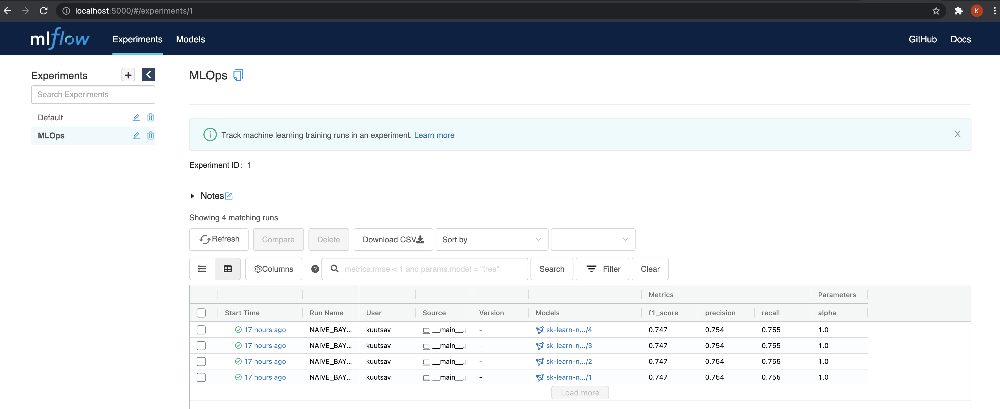
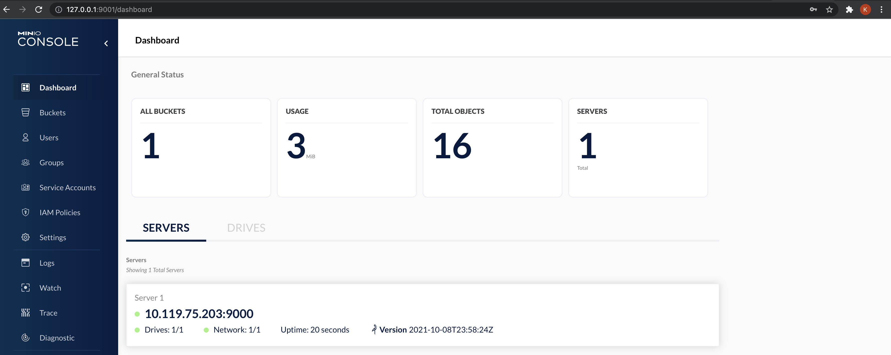
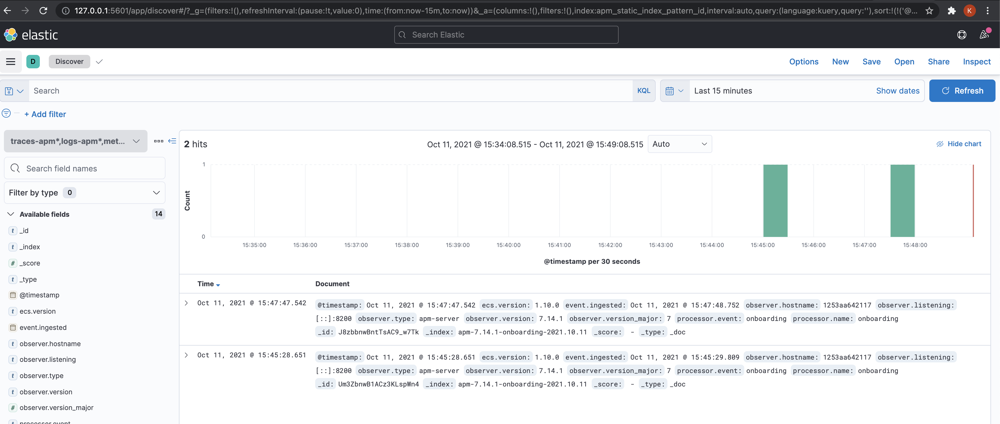

These steps are necessary for operationalization of any `machine-learning` based
model.

    These posts are in no way exhaustive in covering the breadth of MLOps.

    Several key pieces like the CI/CD pipeline, monitoring for drift, etc
    are missing at the moment, which might get added later.


## <b>Stack</b>

We will be using the following tools in this project

- Data Pipeline: [Dagster](https://github.com/dagster-io/dagster)
- ML registry: [MLflow](https://github.com/mlflow/mlflow)
- API Development: [FastAPI](https://github.com/tiangolo/fastapi)
- Monitoring: [ElasticAPM](https://www.elastic.co/apm/)


## <b>Dev Setup</b>


### Poetry [#](https://python-poetry.org/)

```bash
$ curl -sSL https://raw.githubusercontent.com/python-poetry/poetry/master/get-poetry.py | python -
$ poetry --version
# Poetry version 1.1.10
```


### pre-commit [#](https://pre-commit.com/)

```bash
$ pip install pre-commit
$ pre-commit --version
# pre-commit 2.15.0
```


### Minio

Follow the instructions here - [Minio installation](https://min.io/download).

For Mac users
```bash
brew install minio/stable/minio
```


### Install python packages

```bash
$ poetry install

# Installing dependencies from lock file
# No dependencies to install or update
# Installing the current project: mlops (0.1.0)
```


### MLflow

```bash 
$ poetry shell
$ export MLFLOW_S3_ENDPOINT_URL=http://127.0.0.1:9000
$ export AWS_ACCESS_KEY_ID=minioadmin
$ export AWS_SECRET_ACCESS_KEY=minioadmin

# make sure that the backend store and artifact locations are same in the .env file as well
$ mlflow server \
    --backend-store-uri sqlite:///mlflow.db \
    --default-artifact-root s3://mlflow \
    --host 0.0.0.0
```




### MinIO

```bash
$ export MINIO_ROOT_USER=minioadmin
$ export MINIO_ROOT_PASSWORD=minioadmin

$ mkdir minio_data
$ minio server minio_data --console-address ":9001"

# API: http://192.168.29.103:9000  http://10.119.80.13:9000  http://127.0.0.1:9000
# RootUser: minioadmin
# RootPass: minioadmin

# Console: http://192.168.29.103:9001 http://10.119.80.13:9001 http://127.0.0.1:9001
# RootUser: minioadmin
# RootPass: minioadmin

# Command-line: https://docs.min.io/docs/minio-client-quickstart-guide
#    $ mc alias set myminio http://192.168.29.103:9000 minioadmin minioadmin

# Documentation: https://docs.min.io
```
Go to `http://127.0.0.1:9001/buckets/` and create a bucket called `mlflow`.




### Dagster

```bash
$ poetry shell
$ dagit -f mlops/pipeline.py
```


### ElasticAPM

```bash
$ docker-compose -f docker-compose-monitoring.yaml up
```




### FastAPI

```bash
$ poetry shell
$ export PYTHONPATH=.
$ python mlops/app/application.py
```


