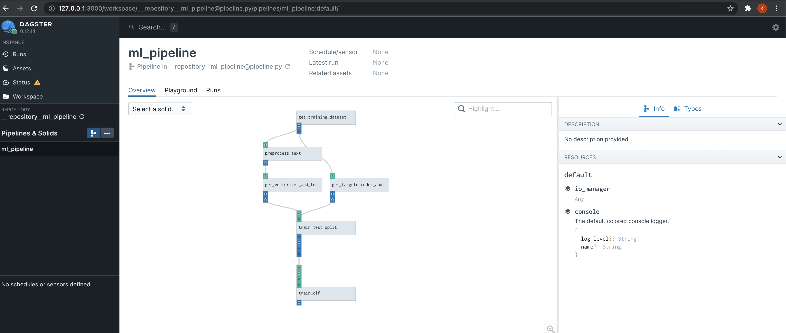
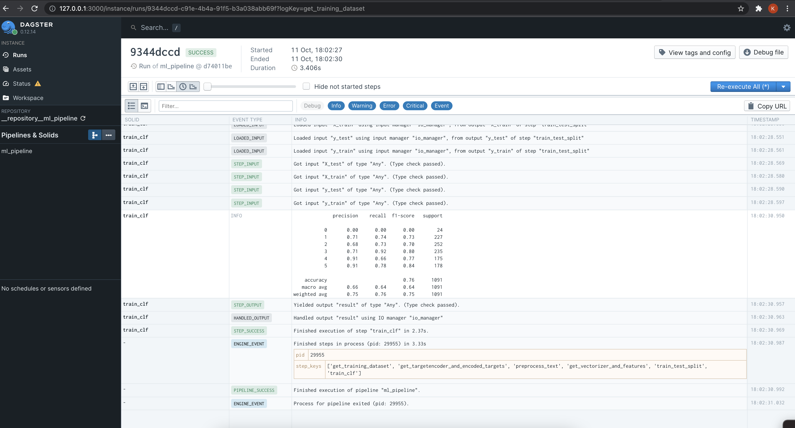

> [Dagster is a data orchestrator for machine learning, analytics, and ETL](https://dagster.io/)

Dagster is a second generation data orchestrator that focues on being
`data-driven` rather than `task-driven`(like `Airflow`).

## Solids and Pipelines [#](https://docs.dagster.io/tutorial/intro-tutorial/single-solid-pipeline)

> Dagster's core abstractions are solids and pipelines. 

> Solids are individual units of computation that we wire together to form pipelines. By default, all solids in a pipeline execute in the same process. In production environments, Dagster is usually configured so that each solid executes in its own process.

## Dataset

Our pipeline will operate on [Question Type Classification](https://www.kaggle.com/ananthu017/question-classification).
This data helps to classify the given Questions
into respective categories based on what type of answer it expects such as a
numerical answer or a text description or a place or human name etc.

| Question      | Category |
| ----------- | ----------- |
| How did serfdom develop in and then leave Russia ? | `DESCRIPTION` |
| What films featured the character Popeye Doyle ? | `ENTITY` |
| How can I find a list of celebrities ' real names ? | `DESCRIPTION` |
| What fowl grabs the spotlight after the Chinese Year of the Monkey ? | `ENTITY` |
| What is the full form of .com ? | `ABBREVIATION` |
| What contemptible scoundrel stole the cork from my lunch ? | `HUMAN` |
| What team did baseball 's St. Louis Browns become ? | `HUMAN` |

Category can take following values - `HUMAN, ENTITY, DESCRIPTION, NUMERIC, LOCATION`.

## Solid [#](https://docs.dagster.io/tutorial/intro-tutorial/single-solid-pipeline#hello-solid)

> A solid is a unit of computation in a data pipeline. Typically, you'll define solids by annotating ordinary Python functions with the @solid decorator.

Our first solid [`get_training_dataset`](https://github.com/kuutsav/MLOps/blob/master/mlops/pipeline.py#L160)
loads the data from csv and returns

- `texts (List[str])` - Question
- `target (List[str])` - Category

```
@solid(
    output_defs=[
        OutputDefinition(name="texts", is_required=True),
        OutputDefinition(name="target", is_required=True),
    ]
)

def get_training_dataset(context):
    texts, target = dataloaders.get_input_dataset(INPUT_DATASET_LOC)
    context.log.info(f"Loaded data; N={len(texts)}, Targets={set(target)}")
    yield Output(texts, "texts")
    yield Output(target, "target")
```

## OutputDefinition [#](https://docs.dagster.io/_apidocs/solids#dagster.OutputDefinition)
> To define multiple outputs, or to use a different output name than "result", you can provide OutputDefinitions to the @solid decorator.
>
> When you have more than one output, you must yield an instance of the Output class to disambiguate between outputs.

Let's look at another solid [`preprocess_text`](https://github.com/kuutsav/MLOps/blob/master/mlops/pipeline.py#L24).

```
@solid
def preprocess_text(context, texts):
    texts = text_preprocessing.preprocess_text(texts)
    context.log.info(f"Text pre-processing done; N={len(texts)}")
    return texts
```

Here, we are doing some text preprocessing. Since we are not returning
mulitple outputs here, we can avoid `OutputDefinition`.

## Pipeline [#](https://docs.dagster.io/tutorial/intro-tutorial/single-solid-pipeline#hello-pipeline)

> To execute our solid, we'll embed it in an equally simple pipeline. A pipeline is a set of solids arranged into a
[DAG](https://en.wikipedia.org/wiki/Directed_acyclic_graph) of computation. You'll typically define pipelines by annotating ordinary Python functions with the [@pipeline](https://en.wikipedia.org/wiki/Directed_acyclic_graph) decorator.

Let's look at our Pipeline.

```
@pipeline
def ml_pipeline():
    # 1. fetch training data
    texts, target = get_training_dataset()
    # 2. minimal text preprocessing
    # 3. tfidf vectorization
    vectorizer, X = get_vectorizer_and_features(preprocess_text(texts))
    # 4. target encoding
    target_encoder, encoded_target = get_targetencoder_and_encoded_targets(target)
    # 5. train test split
    X_train, X_test, y_train, y_test = train_test_split(X, encoded_target)
    # 6. model training, validation, registry, artifact storage
    train_clf(X_train, X_test, y_train, y_test)
```

Here we call few solids like `get_training_dataset`, `preprocess_text`,
`get_vectorizer_and_features`, etc.

These calls don't actually execute the solids. Within the bodies of functions
decorated with @pipeline, we use function calls to indicate the dependency
structure of the solids making up the pipeline.

## Executing Our First Pipeline [#](https://docs.dagster.io/tutorial/intro-tutorial/single-solid-pipeline#executing-our-first-pipeline)

Dagit to visualize our pipeline in Dagit, from the directory in which we have saved
the pipeline file.

```bash
$ dagit -f mlops/pipeline.py
# Loading repository... Serving on http://127.0.0.1:3000
```

We can head over to the browser and look at the pipeline.



To execute the pipeline from the UI, head over to the `playground` section and
click `Launch Execution` (at the bottom right).

If the pipeline executed successfully, you should see logs like this.



The pipeline we just executed registered our trained model using `MLflow` and
stored the model artifacts using `minio`.

We will look at those components in the next part.
