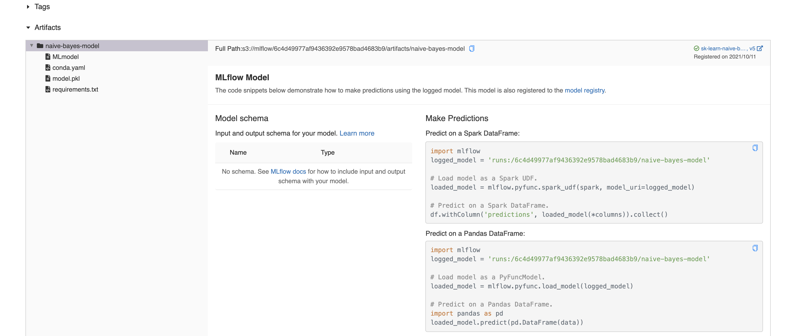
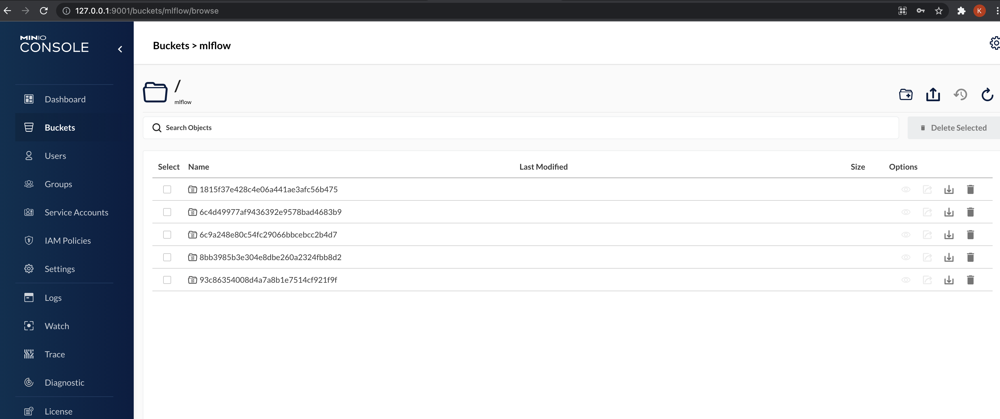

```
@pipeline
def ml_pipeline():
    # 1. fetch training data
    texts, target = get_training_dataset()
    # 2. minimal text preprocessing
    # 3. tfidf vectorization
    vectorizer, X = get_vectorizer_and_features(preprocess_text(texts))
    # 4. target encoding
    target_encoder, encoded_target = get_targetencoder_and_encoded_targets(target)
    # 5. train test split
    X_train, X_test, y_train, y_test = train_test_split(X, encoded_target)
    # 6. model training, validation, registry, artifact storage
    train_clf(X_train, X_test, y_train, y_test)
```

## MLflow [#](https://www.mlflow.org/docs/latest/index.html)

> MLflow is an open source platform for managing the end-to-end machine learning lifecycle. It tackles four primary functions:
>
> Tracking experiments to record and compare parameters and results (MLflow Tracking).
>
> Packaging ML code in a reusable, reproducible form in order to share with other data scientists or transfer to production (MLflow Projects).
>
> Managing and deploying models from a variety of ML libraries to a variety of model serving and inference platforms (MLflow Models).
>
> Providing a central model store to collaboratively manage the full lifecycle of an MLflow Model, including model versioning, stage transitions, and annotations (MLflow Model Registry).

For our usecase, we mainly focus on `Mlflow Tracking` and `Mlflow Registry`.

`train_clf()` internally calls [`train_and_validate_clf()`](https://github.com/kuutsav/MLOps/blob/master/mlops/ml_workflow/naive_bayes_clf.py#L25) located at `mlops/ml_workflow/naive_bayes_clf.py`.

This script has as all the MLflow components and we will look at those in detail.

## Tracking [#](https://www.mlflow.org/docs/latest/tracking.html)

```
# setting env vars for minio artifact storage
set_env_vars()

mlflow.set_tracking_uri(os.getenv("MLFLOW_TRACKING_URI"))

# creates a new mlflow experiment MLFLOW_EXPERIMENT_NAME if it doesn't exist
exps = [exp.name for exp in mlflow.tracking.MlflowClient().list_experiments()]
if not os.getenv("MLFLOW_EXPERIMENT_NAME") in exps:
    mlflow.create_experiment(
        os.getenv("MLFLOW_EXPERIMENT_NAME"),
        artifact_location=os.getenv("MLFLOW_ARTIFACT_LOCATION"),
    )
```

> MLflow runs can be recorded to local files, to a SQLAlchemy compatible database, or remotely to a tracking server. By default, the MLflow Python API logs runs locally to files in an mlruns directory wherever you ran your program. You can then run mlflow ui to see the logged runs.
>
> To log runs remotely, set the MLFLOW_TRACKING_URI environment variable to a tracking server’s URI or call mlflow.set_tracking_uri().
>
> There are different kinds of remote tracking URIs:
>
> - Local file path (specified as file:/my/local/dir), where data is just directly stored locally.
> - Database encoded as <dialect>+<driver>://<username>:<password>@<host>:<port>/<database>. MLflow supports the dialects mysql, mssql, sqlite, and postgresql. For more details, see SQLAlchemy database uri.
> - HTTP server (specified as https://my-server:5000), which is a server hosting an MLflow tracking server.
> - Databricks workspace (specified as databricks or as databricks://<profileName>, a Databricks CLI profile. Refer to Access the MLflow tracking server from outside Databricks [AWS] [Azure], or the quickstart to easily get started with hosted MLflow on Databricks Community Edition.

We use `sqlite` for tracking. `MLFLOW_TRACKING_URI=sqlite:///mlflow.db`.
This file stays at the root directory of the project.

> You can optionally organize runs into experiments, which group together runs for a specific task. You can create an experiment using the mlflow experiments CLI, with mlflow.create_experiment(), or using the corresponding REST parameters. The MLflow API and UI let you create and search for experiments.

```
# setting env vars for minio artifact storage
set_env_vars()

mlflow.set_tracking_uri(os.getenv("MLFLOW_TRACKING_URI"))

# creates a new mlflow experiment MLFLOW_EXPERIMENT_NAME if it doesn't exist
exps = [exp.name for exp in mlflow.tracking.MlflowClient().list_experiments()]
if not os.getenv("MLFLOW_EXPERIMENT_NAME") in exps:
    mlflow.create_experiment(
        os.getenv("MLFLOW_EXPERIMENT_NAME"),
        artifact_location=os.getenv("MLFLOW_ARTIFACT_LOCATION"),
    )
```

First time we execute the pipeline, experiment `MLFLOW_EXPERIMENT_NAME=MLOps` is
created and is used for subsequent runs.

```
def train_and_validate_clf(
    X_train: np.array, X_test: np.array, y_train: np.array, y_test: np.array
) -> str:
    mlflow.set_experiment(os.getenv("MLFLOW_EXPERIMENT_NAME"))

    with mlflow.start_run(run_name="NAIVE_BAYES_CLF"):
        ...
```

## Registry [#](https://www.mlflow.org/docs/latest/model-registry.html#)

Under an experiment, we can log metrics, log model parameters, save and version
model artifacts.

These steps come under the purview of `model-registry`.

Here, we log

- classifier parameter `alpha`
- classification metrics `precision`, `recall` and `f1_score`

We also save and version the model using `mlflow.sklearn.log_model`.
Each subsequent run of the pipeline with the same `artifact_path` and
`registered_model_name` increases the model version by 1 in the registry.

```
def train_and_validate_clf(
    X_train: np.array, X_test: np.array, y_train: np.array, y_test: np.array
) -> str:
    mlflow.set_experiment(os.getenv("MLFLOW_EXPERIMENT_NAME"))

    with mlflow.start_run(run_name="NAIVE_BAYES_CLF"):
        clf = MultinomialNB()
        mlflow.log_param("alpha", clf.get_params()["alpha"])
        clf.fit(X_train, y_train)
        y_pred = clf.predict(X_test)
        scores = precision_recall_fscore_support(y_test, y_pred, average="weighted")
        mlflow.log_metric("precision", scores[0])
        mlflow.log_metric("recall", scores[1])
        mlflow.log_metric("f1_score", scores[2])
        mlflow.sklearn.log_model(
            sk_model=clf,
            artifact_path="naive-bayes-model",
            registered_model_name="sk-learn-naive-bayes-clf-model",
        )

        return classification_report(y_test, y_pred)
```

Heading over to the experiment section at `http://127.0.0.1:5000`, we can see
the registry entry for each of our runs, along with the logged metrics and
model parameters.


For each run, we can also look at the artifact location.



When we created the experiment, we speficified
`artifact_location=os.getenv("MLFLOW_ARTIFACT_LOCATION")` where
`MLFLOW_ARTIFACT_LOCATION=s3://mlflow`. Internally, this stores the
model artifacts locally at the directory `minio_data` we created during the
setup.

We can head over to `http://127.0.0.1:9001/buckets/mlflow/browse` to look at
the saved model artifacts.



In the next part, we will look at serving the trained model being a REST endpoint.
