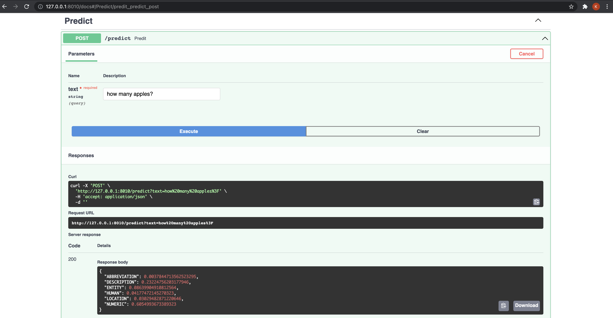
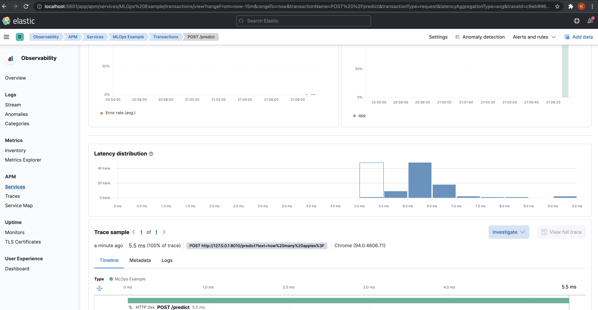
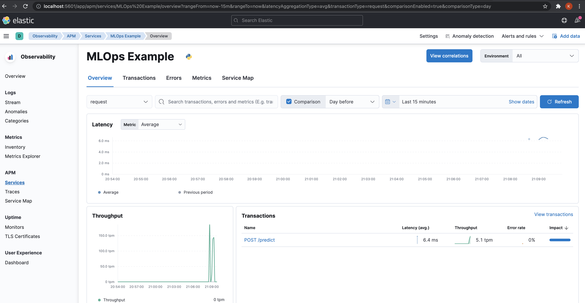

We will use FastAPI to serve our trained models behind a REST endpoint.

Scripts related to the APIs are located at [MLOps/app](https://github.com/kuutsav/MLOps/tree/master/mlops/app).

```bash
├── application.py     # FastAPI app and launcher uvicorn.run
├── models             # pydantic model for reponse validation
│   └── predict.py     # pydantic model for predict endpoint
└── routes             # to maintain larger applications
    ├── endpoints
    │   └── predict.py # predict endpoint
    └── router.py      # APIRouter module to maintain larger apps
```


    Though we have used the `APIRouter` module here, it's really needed when
    we have lots of API endpoints in a larger app.

    Look at [`https://fastapi.tiangolo.com/tutorial/bigger-applications/`](https://fastapi.tiangolo.com/tutorial/bigger-applications/)


## Model Artifacts

To use the model to get predictions, we need to load all the model related
artifacts.

We load the trained model directly using the `mlflow.sklearn` module.
Here we load the version number `1` of our `sk-learn-naive-bayes-clf-model` model.

```
# manually pick the model version from trained models
sk_model = mlflow.sklearn.load_model(model_uri="models:/sk-learn-naive-bayes-clf-model/1")

# mlflow does not store data manipulation routines like label encoding
# we need to manage the LabelEncoder and TfidfVectorizer ourselves
with open(BASE_DIR / "artifacts/target_encoder.pkl", "rb") as f:
    target_encoder = pickle.load(f)
with open(BASE_DIR / "artifacts/vectorizer.pkl", "rb") as f:
    vectorizer = pickle.load(f)
logger.info("Loaded model artifacts")
```

Beyond the trained classifier, we also need the `TfidfVectorizer` to vectorize
the text and `LabelEncoder` to map the predictions to actual labels.

These artifacts are not saved/managed by MLflow as it only mangages the
artifacts realted to the ML algorithm. [#](https://www.mlflow.org/docs/latest/_modules/mlflow/sklearn.html)

> Exclude certain preprocessing & feature manipulation estimators from patching. These estimators represent data manipulation routines (e.g., normalization, label encoding) rather than ML algorithms. Accordingly, we should not create MLflow runs and log parameters / metrics for these routines, unless they are captured as part of an ML pipeline (via `sklearn.pipeline.Pipeline`)

```
# manually pick the model version from trained models
sk_model = mlflow.sklearn.load_model(model_uri="models:/sk-learn-naive-bayes-clf-model/1")

# mlflow does not store data manipulation routines like label encoding
# we need to manage the TfidfVectorizer and TfidfVectorizer ourselves
with open(BASE_DIR / "artifacts/target_encoder.pkl", "rb") as f:
    target_encoder = pickle.load(f)
with open(BASE_DIR / "artifacts/vectorizer.pkl", "rb") as f:
    vectorizer = pickle.load(f)
logger.info("Loaded model artifacts")
```

## Predict Endpoint [#](https://github.com/kuutsav/MLOps/blob/master/mlops/app/routes/endpoints/predict.py)

Let's look at the `/predict` endpoint.

```
@router.post("/predict")
async def predit(text: str) -> PredictResponseModel:
    logger.info(f"Received text for prediction: {text}")
    processed_text_list = preprocess_text([text])
    x = vectorizer.transform(processed_text_list)
    pred = sk_model.predict_proba(x)
    mapped_pred = dict(zip(target_encoder.classes_, pred[0]))
    logger.info(f"Prediction: {mapped_pred}")

    return PredictResponseModel(preds=mapped_pred).preds
```

Here, we preprocess the text using `preprocess_text()`, vectorize it using
`vectorizer.transform()` and finally generate predictions using the
classifier `sk_model.predict_proba()`.

We then map the probabilities to the actual labels(`target_encoder.classes_`)
and return the predictions by wrapping around the `PredictResponseModel` pydantic
model for data validation.

The API can be accessed at `http://127.0.0.1:8010/docs`.



## ElasticAPM

We have also added [`ElasticAPM`](https://www.elastic.co/apm/) as a middleware for
monitoring our FastAPI application. [#](https://github.com/kuutsav/MLOps/blob/master/mlops/app/application.py)

```
import uvicorn
from elasticapm.contrib.starlette import ElasticAPM, make_apm_client
from fastapi import FastAPI
from loguru import logger

from mlops.app.routes.router import api_router


def get_fastapi_application() -> FastAPI:
    application = FastAPI(title="MLOps")
    application.add_middleware(
        ElasticAPM, client=make_apm_client({"SERVICE_NAME": "MLOps Example"})
    )
    application.include_router(api_router)
    return application


app = get_fastapi_application()


if __name__ == "__main__":
    logger.info("*** Starting Prediction Server ***")
    uvicorn.run(app, host="127.0.0.1", port=8010)
```

Once we start using the `/predict` endpoint, we can head over to `http://localhost:5601/`
to look at the app related metrics like `Latency`, `Throughput` etc, and system
level metrics like `CPU usage` and `System memory usage`.




Under the hood, it uses `Elastic Search`, `Kibana` and an `APM server` launched
using the `docker-compose-monitoring.yaml` during the setup.

The dashboard also provides a `trace` for each request.
